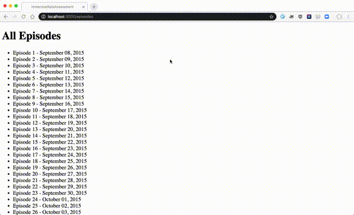

# Rails Code Challenge - Late Show

For this assessment, you'll be working with Late Night TV show domain.

In this repo, there is a Rails application with some features built out. Your job is to extend this code to add the functionality described in the deliverables below.

## Topics

- MVC
- REST
- Request-Response Cycle
- Forms and Form Helpers
- ActiveRecord
- Validations

## Setup

Before you begin coding your solution, clone this repo and then `cd` into it. Then delete the existing Gemlock.lock file, run `bundle install`, `rails db:migrate`, and `rails db:seed` to install dependencies and set up the database, and run `rails s` to start the server.

## The Domain

The application keeps track of the guests that have appeared on the show.

There are three models in the domain: Guest, Episode, and Appearance.

Guests and Episodes have a many to many relationship through Appearances. A single Appearance belongs to one Guest and one Episode.

## What You Already Have

The starter code includes migrations, models, and seed data for Guests and Episodes. There are also routes, controller actions, and views to support listing the guests and episodes.

After running the setup instructions above, visiting `'/guests'` will display all of the guests, and visiting `'/episodes'` will display all of the episodes.

***Schema***

Episodes

| Column | Type |
| ------------- | ------------- |
| date  | Date  |
| number  | Integer  |
| created_at  | DateTime  |
| updated_at  | DateTime  |

Guests

| Column | Type |
| ------------- | ------------- |
| name  | String  |
| occupation  | String  |
| created_at  | DateTime  |
| updated_at  | DateTime  |

### Model Methods and Validations

- None

### Routes, Controllers and Views

- Episodes index
- Guests index

## Instructions

Update the code of the application to meet the following deliverables. Follow RESTful naming conventions and the MVC pattern to divide responsibility.

***Read through these deliverables carefully to understand the requirements for this code challenge. Tackle them one by one, as they build on each other sequentially.***

### 1. Appearance Model

To log that a specific Guest appeared on a certain Episode, we need to create the Appearance model. **Make the necessary updates to the schema and models** so that:

- Guest can appear on many episodes
- Episode can have multiple guests
- Appearance stores a numeric rating

### 2. New Appearance Form

A user can fill out a form to create a new Appearance. They can:

- Choose an existing guest from a select dropdown
- Choose an existing episode from a select dropdown
- Enter a numeric rating
- Submit the form

After submitting the form, the user should be redirected to the selected episode's show page.

### 3. Episode Show Page

On the episode show page, a user should see:

- Episode date
- A list of the guests who were on that episode
- Each guest's name should link to the Guest Show page

### 4. Guest Show Page Episode links

On the Guest show page, add a list of the Episodes the Guest has appeared on.

For each Episode, show the:

- date of the Episode
- rating for the Appearance

Each Episode date should link to the show page for that Episode.

### 5. Advanced: Appearance Rating Validation

The rating on an Appearance should be between 1 and 5 (inclusive - `1` and `5` are okay).

- Add a validation to ensure that the rating is between 1 and 5.
- Add handling for this error to the Appearance create action.
- The validation error should be shown on the Appearance creation form when a user attempts to save an appearance with an invalid rating.

### 6. Advanced: Additional Appearance Validation

A Guest should only appear on a given Episode once.

- Add a validation to Appearance to ensure that each Guest can only appear once on the same Episode.
- Update the error handling on the Appearance creation form to show this validation error.

### 7. Advanced: Episode Average Rating

On the Episode show page, show the average rating of the Appearances for the episode.

### 8. Advanced: Guest Show Page Appearance Ordering

On the Guest show page, order the Episodes by the Appearance rating so that the highest rated shows first in the list.

### Feature Demo

## Rubric

You can find the rubric for this assessment [here](https://github.com/learn-co-curriculum/se-rubrics/blob/master/module-2.md).
