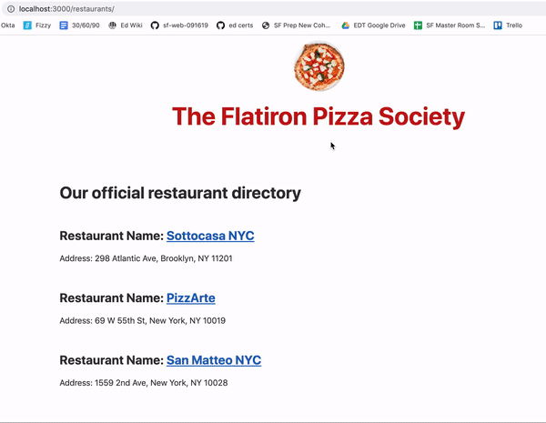

# Rails Code Challenge - Pizza Restaurants

For this assessment, you'll be working with a Pizza Restaurant domain.

In this repo, there is a Rails application with some features built out. Your job is to extend this code to add the functionality described in the deliverables below.

## Topics

- MVC
- REST
- Request-Response Cycle
- Forms and Form Helpers
- ActiveRecord
- Validations

## Setup

Before you begin coding your solution, clone this repo and then `cd` into it. Then run `bundle install`, `rails db:migrate`, and `rails db:seed` to install dependencies and set up the database, and run `rails s` to start the server.

## Domain

There are three models in the domain: Restaurant, Pizza, and a join model RestaurantPizza.

Each Restaurant can have many Pizzas. Each Pizza can belong to multiple Restaurants.

## What You Already Have

The starter code has migrations, models, and seed data for the initial Pizza and Restaurant models. There are routes, controllers and views to support listing Restaurants and Pizzas.

Once you have followed the setup instructions above, visiting the `/restaurants` route will display all of the Restaurants. Similarly, visiting `/pizzas` will list all the pizzas.

***Schema***

Restaurant

| Column | Type |
| ------------- | ------------- |
| name | String |
| address | String |

Pizza

| Column | Type |
| ------------- | ------------- |
| name  | String  |
| ingredients | String  |
| created_at  | DateTime  |
| updated_at  | DateTime  |

## Instructions

Update the code of the application to meet the following deliverables. Follow RESTful naming conventions and the MVC pattern to divide responsibility.

***Read through these deliverables carefully to understand the requirements for this code challenge. Tackle them one by one, as they build on each other sequentially.***

### 1. Create the RestaurantPizza Association

Each Restaurant can have many Pizzas and each Pizza can belong to multiple Restaurants. Each Restaurant can set the price of a Pizza to an integer. Update the schema and models to create the RestaurantPizza relationship so that:

- A Pizza can be sold at many Restaurants
- A Restaurant can sell many Pizzas
- RestaurantPizza stores an integer price for each pizza (Remember, each Restaurant can choose how to price its own Pizzas)

### 2. Pizza Show Page

There should be a show page for each Pizza. It should display the name and ingredients.

### 3. Restaurant Show Page

There should be a show page for each Restaurant. It should include:

- the Restaurant's name and address
- a list of the Pizzas it sells

Each pizza in the list should link to that Pizza's show page.

### 4. Restaurants Index Page Links

On the Restaurant index page, each Restaurant's name should link to the restaurant's show page.

### 5. RestaurantPizza Form

Add controller actions and views necessary to show a form to associate a Pizza with a Restaurant. The user can:

- Choose an existing Pizza from a select dropdown
- Choose an existing Restaurant from a select dropdown
- Enter a numeric price
- Click a button to save the RestaurantPizza association

After submitting, the user should be redirected to the selected Restaurant's show page.

### 6. RestaurantPizza Validation

Add validations to the RestaurantPizza model so that each RestaurantPizza must have:

- A price between 1 and 30
- Add handling for this error to the RestaurantPizza create action
- The validation error should be shown on the RestaurantPizza creation form when a user attempts to save a RestaurantPizza with an invalid price

### 7. Advanced: Additional RestaurantPizza Validation

A Pizza should only be associated with the same Restaurant once. (It wouldn't make sense for Pizza Hut to have Cheese Pizza listed on its menu twice!)

Add a validation to RestaurantPizza to ensure that each Pizza can only appear once on the same Restaurant's menu.
Update the error handling on the RestaurantPizza creation form to show this validation error.

### 8. Advanced: Display Count of Restaurants on Pizza Index Page

On the Pizza index page, display the number of Restaurants that have that Pizza next to each Pizza's name.

### 9. Advanced: Restaurant Average Pizza Price

Show the average price of a Pizza on the Restaurant show page. 

To calculate the average, add up all of the Restaurant's Pizzas' prices, and then divide by the number of Pizzas.

### Feature Demo

## Rubric

You can find the rubric for this assessment [here](https://github.com/learn-co-curriculum/se-rubrics/blob/master/module-2.md).
